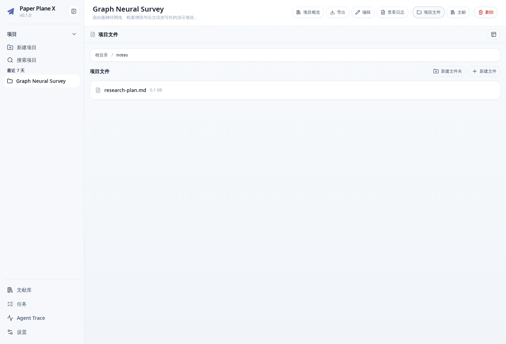
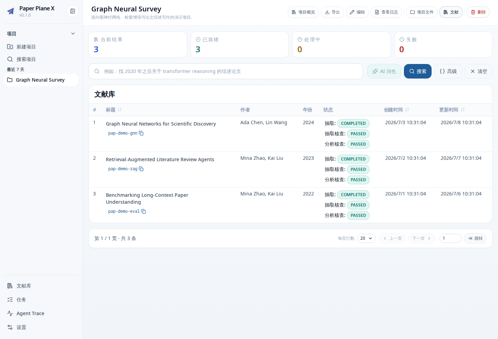
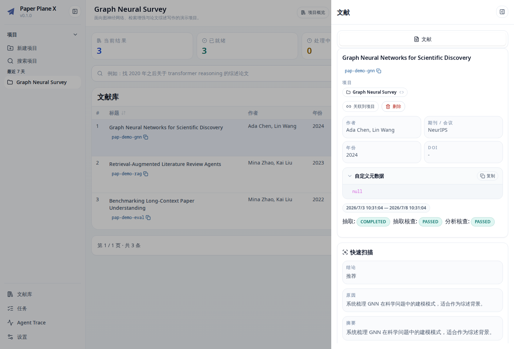
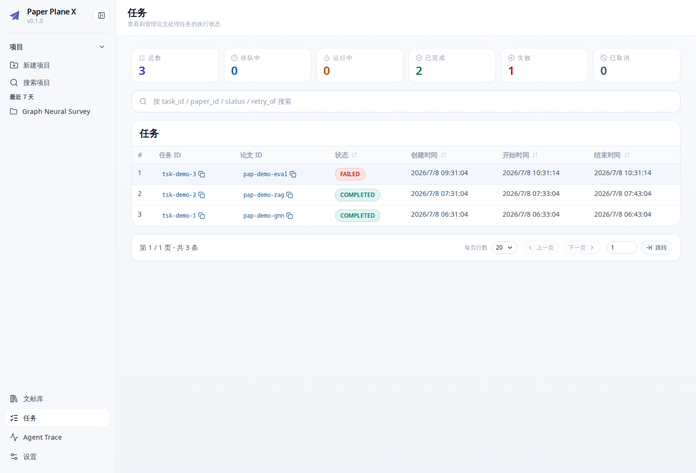
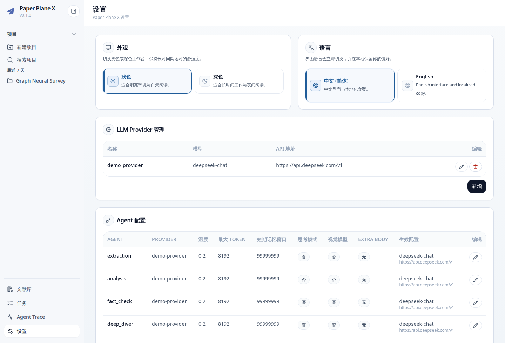

# Paper Plane X Frontend

[](https://vuejs.org/)
[](https://www.typescriptlang.org/)
[](LICENSE)

Paper Plane X Frontend 是 Paper Plane X 的 Vue 3 Web 控制台。它面向日常研究工作，将项目、论文、文献检索、后台任务、Agent traces 和运行时设置集中在一个响应式界面中。

前端不直接访问数据库或文件系统；所有数据均通过 Paper Plane X Backend `/api/v1` API 读取和修改。

## 主要页面

| 页面          | 用途                                                              |
| ------------- | ----------------------------------------------------------------- |
| Projects      | 创建项目，查看项目概览、论文和研究状态                            |
| Project Files | 管理项目笔记、草稿和数据文件，并导出 Markdown、HTML、DOCX 或 PDF  |
| Library       | 浏览和筛选全库论文，打开结构化论文详情                            |
| Tasks         | 查看 PDF 解析和 Agent 后台任务状态                                |
| Agent Traces  | 检查 LLM 调用、工具调用、token 使用和错误                         |
| Settings      | 配置语言、外观、LLM Provider、Agent、PDF Parser、Pandoc 和 worker |

## 界面预览

### 项目文件



### 文献库与论文详情





### 任务与设置





## 面向用户

普通用户无需克隆或构建 frontend。推荐从 Paper Plane X Release 下载 `paper-plane-x-console-vX.Y.Z.tar.gz`，解压到独立 backend 仓库的 `data/console/`，再由 backend 直接托管。Docker 镜像也已经内置对应版本的 Web Console。

完整安装说明见 [Paper Plane X monorepo](https://github.com/WindLX/paper_plane_x)。

### 首次使用流程

1. 打开 Settings，添加 LLM Provider。
2. 为所有 Agent 绑定 Provider。
3. 选择并配置本地或云端 PDF Parser。
4. 如需文档导出，配置 Pandoc 和 PDF engine。
5. 创建项目，并通过 Web 或 Zotero 上传论文。
6. 在 Tasks 中等待处理完成。
7. 在 Library 或项目论文页查看结构化结果。
8. 在 Project Files 中沉淀笔记、矩阵和草稿。

## 面向开发者：快速开始

### 运行要求

- Node.js 24（与 CI 一致）
- pnpm 10+
- 正在运行的 Paper Plane X Backend

### 在 monorepo 中开发

```bash
git clone --recursive https://github.com/WindLX/paper_plane_x.git
cd paper_plane_x/paper_plane_x_frontend
pnpm install
cp .env.example .env
pnpm dev
```

### 独立克隆 frontend

```bash
git clone https://github.com/WindLX/paper_plane_x_frontend.git
cd paper_plane_x_frontend
pnpm install
cp .env.example .env
pnpm dev
```

默认开发地址是 `http://127.0.0.1:5173`。

## API 配置

开发环境默认连接：

```text
http://127.0.0.1:8000/api/v1
```

在 `.env` 或 `.env.development` 中覆盖：

```dotenv
VITE_API_BASE_URL=http://127.0.0.1:8000/api/v1
```

API base URL 的优先级：

1. backend 托管页面时注入的运行时配置；
2. `VITE_API_BASE_URL`；
3. 默认值 `http://127.0.0.1:8000/api/v1`。

不要在 `VITE_*` 变量中放置 API key 或其他秘密；Vite 会把公开环境变量编译进浏览器产物。

## 构建与部署

### 独立静态站点

```bash
pnpm build
```

产物位于 `dist/`。独立部署时需要配置 `VITE_API_BASE_URL`，并确保 backend CORS 允许该站点来源。

### 由 backend 托管（推荐）

```bash
pnpm build:console
```

产物写入：

```text
../paper_plane_x_backend/data/console/
```

随后启动 backend 并访问 `http://127.0.0.1:8000`。这种模式由 backend 注入 API 地址，无需为每个部署环境重新构建 frontend。

快速构建（跳过 typecheck，仅适用于已单独完成类型检查的流程）：

```bash
pnpm build:console:fast
```

## 项目结构

```text
src/
├── api/          # HTTP 与 WebSocket API clients
├── components/   # 可复用 UI 与业务组件
├── composables/  # 页面和业务控制器
├── i18n/         # 中文与英文文案
├── router/       # Vue Router
├── stores/       # Pinia stores
├── types/        # API 与领域类型
└── views/        # 页面入口
```

设计约定位于 [`design-system/`](design-system/)。新增页面或组件时，应优先复用现有 token、`AppButton`、`AppSelect`、modal、notify 和 layout 组件。

## 开发命令

推荐使用 `just`：

```bash
just setup
just dev
just format-check
just lint
just typecheck
just test
just build
just build-console
just pre-commit
```

对应 pnpm 命令：

| 命令                 | 作用                          |
| -------------------- | ----------------------------- |
| `pnpm dev`           | 启动 Vite 开发服务器          |
| `pnpm lint`          | 执行 ESLint                   |
| `pnpm lint:fix`      | 修复可自动处理的 lint 问题    |
| `pnpm format`        | 使用 Prettier 格式化          |
| `pnpm format:check`  | 检查格式，不修改文件          |
| `pnpm test`          | 运行 Vitest                   |
| `pnpm build`         | 运行 `vue-tsc` 并构建独立站点 |
| `pnpm build:console` | 构建 backend-hosted console   |

## 测试与质量要求

- 配置、API client 和纯逻辑优先添加 Vitest 测试。
- UI 行为改动至少运行 `pnpm lint` 和 `pnpm build`。
- API schema 变更应同步更新 `src/types/api` 和调用方。
- 用户可见文案必须同时更新中文和英文 i18n。
- UI 变化请在 PR 中附前后截图或录屏。

提交前执行：

```bash
just pre-commit
```

## 贡献与 Pull Request

1. 从最新 `main` 创建功能分支。
2. 保持组件职责清晰，优先复用现有 UI 和 composable。
3. 不要把 API key、`.env`、`dist/` 或 `node_modules/` 提交到仓库。
4. 更新受影响的测试、i18n、类型和 README。
5. 提交前运行 `just pre-commit`。
6. PR 描述应包含动机、用户影响、验证命令；视觉改动请附截图。

如果改动还要求 backend API 变化，应先在 backend 子仓库完成对应 PR，并在说明中链接两个 PR。

问题与功能建议请提交到 [Issues](https://github.com/WindLX/paper_plane_x_frontend/issues)。提交日志或截图前请移除服务地址中的敏感信息和任何访问令牌。

## Release

frontend 版本由 monorepo 根目录 `VERSION` 统一维护。正式发布由顶层 tag workflow 构建一次 Web Console，并生成：

- `paper-plane-x-console-vX.Y.Z.tar.gz`；
- 内置 console 的 backend Docker 镜像。

Web Console 本身仍是标准静态 Vite 构建，但官方 Release 不再重复发布内容相同的 standalone frontend 压缩包。不要在子仓库单独修改版本号；版本变更应通过 monorepo 的 `scripts/sync_version.py` 完成。

## License

Paper Plane X Frontend 使用 [GNU Affero General Public License v3.0 or later](LICENSE)。
