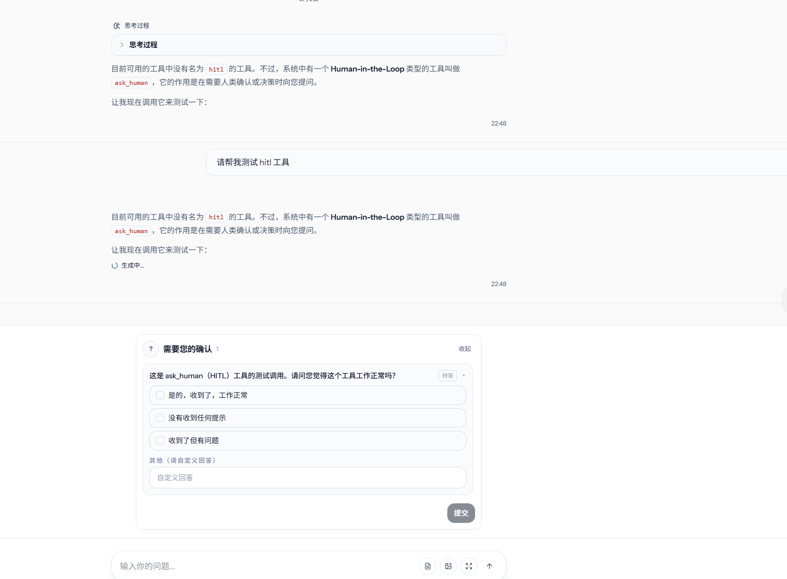
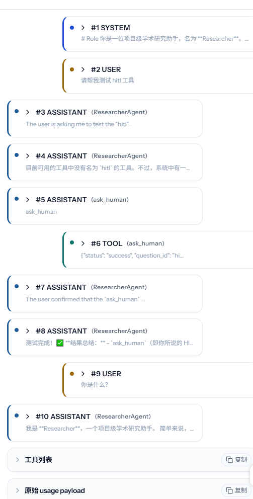

# Paper Plane X Frontend

前端基于 Vue 3 + TypeScript + Vite，用来提供一个轻量控制台，覆盖当前最常用的后端操作：

- 浏览项目
- 浏览项目内论文
- 查看任务队列与任务详情
- 查看 Agent traces
- 下载项目导出结果

## 1. 开发启动

```bash
cd paper_plane_x_frontend
pnpm install
cp .env.example .env
pnpm dev
```

默认地址：

- `http://127.0.0.1:5173`

## 2. 环境变量

前端当前只依赖一个公开环境变量：

- `VITE_API_BASE_URL`

默认值见：

- `.env.example`
- `.env.development`

默认本地后端地址：

- `http://127.0.0.1:8000/api/v1`

如果你想把前端连到局域网内另一台机器上的后端，只需要修改：

```env
VITE_API_BASE_URL=http://your-host:8000/api/v1
```

## 3. 构建与检查

```bash
pnpm test
pnpm vue-tsc
pnpm build
pnpm preview
pnpm build:console
```

其中：

- `pnpm build`：构建普通前端产物到 `dist/`
- `pnpm build:console`：构建并输出到 `../paper_plane_x_backend/data/console`
- `pnpm build:console:fast`：跳过类型检查，直接构建 console

## 4. 当前页面

当前控制台主要页面：

- `/projects`
- `/projects/:projectId`
- `/tasks`
- `/tasks/:taskId`

## 5. 配置实现方式

前端配置不再在业务代码里直接散落读取 `import.meta.env`，而是统一通过：

- `src/config.ts`

这样做的目的很简单：

- 默认值更集中
- 测试更容易写
- 以后如果新增前端配置项，不需要满项目搜字符串

## 6. 与后端的关系

前端本身只负责控制台，不处理论文解析逻辑。  
真正的数据处理都在后端完成，前端只是消费这些接口：

- `/api/v1/projects`
- `/api/v1/papers`
- `/api/v1/projects/{project_id}/papers`
- `/api/v1/data-process/tasks`
- `/api/v1/agent-traces`

## 7. 常见问题

### 页面能打开，但接口请求失败

优先检查：

- `VITE_API_BASE_URL` 是否正确
- 后端是否真的启动在对应地址
- 后端 CORS 配置是否允许当前来源

### 后端根路径没有出现控制台

后端只有在找到构建好的 console 静态文件后，才会托管前端页面。  
如果你想让后端直接提供 console，请先执行：

```bash
pnpm build:console
```


## TODO

### debug && refactor

- [x] library, tasks, agent trace, settings页面如果调用了api（新增，删除，修改等会改变后端数据的操作，还有 load, error）需要提供事件，通知前端重新获取数据，且可以避免 watch 操作
- [x] tasks websocket
- [x] websocket 收入 pinia 全局状态管理
- [ ] 小 button 组件复用
- [ ] 前端消息管理
- [x] 侧边栏无限滚动，涉及到两个侧边栏 + 搜索项目 + 搜索对话
- [x] 重整 project store, conversation store
- [ ] project 的 button 复用
- [ ] topbar i18n 问题，可以收起，button 复用
- [x] drawer ui 优化，状态保持
  - [x] 沙箱文件展示优化
  - [x] 沙箱文件可以打开展示
- [x] message card 的缩略文案宽度优化
- [x] hitl 全局占用优化
- [x] 删除项目后的跳转问题
- [ ] dialog 整治
- [x] chatinputbox 组件的复用化，同步给消息编辑
- [x] 消息编辑/重新运行/删除/fork的bug整治
- [ ] pandoc 文件格式导出问题
- [x] chat 的对话跳转 topbar 状态
- [x] chat drawer traces 滚动 lazy load
- [x] chat drawer markdown 高度问题
- [x] chattopbar 的 icon 位置
- [x] 新对话的 chat topbar icon 不显示
- [x] 修复sidebar 横向宽度 overflow 省略的问题
- [ ] project 的日志面板整治
- [ ] chatview 渲染问题
  - [ ] 使用工具的时候生成ing 消失
  - [ ] 用户气泡过长
  - [ ]  对话中进入别的页面再跳转回来渲染 bug，似乎只会由 hitl 触发
  - [ ] hitl 还会留下 empty state
  - [ ] 终止对话按钮位置应该放在气泡下面，且终止对话无效
  - [ ] 对话中点击 paper 无法跳转
  - [ ] 对话详情按钮可以放到 chattopbar 里
  - [ ]  trace 记录存在 bug
- [ ] 右侧边栏的宽度问题

### new feature

- [ ] skills
- [ ] ppt 制作
- [ ] juypter sandbox
- [ ] mineru token
- [ ] 导出项目支持导出对话

### docs

- [ ] 整治文档